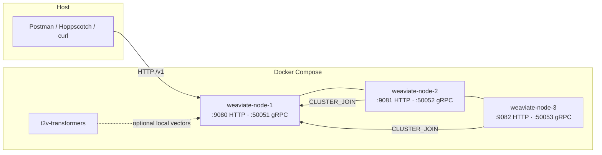

# Weaviate Vector DB Starter

Local **3-node Weaviate cluster** plus a Postman / Hoppscotch collection for exploring the REST and GraphQL APIs. Spin up a Raft-backed vector database on Docker, then query, schema, and ingest without writing a client first.

[](LICENSE)
[](https://weaviate.io)
[](docker-compose.yml)

> Ask questions against your data in natural language instead of SQL. Vectorize with OpenAI, Cohere, Hugging Face, or bring your own embeddings.

## What's in the box

| Piece | Role |
| --- | --- |
| [`docker-compose.yml`](docker-compose.yml) | Three Weaviate nodes (`node1`–`node3`) with Raft clustering |
| [`weaviate.postman_collection.json`](weaviate.postman_collection.json) | REST + GraphQL requests for schema, objects, batch, backups, cluster, and more |
| `t2v-transformers` sidecar | Optional local Sentence Transformers inference (`multi-qa-MiniLM-L6-cos-v1`) |

Anonymous access is enabled for local development. Do not expose this stack to the internet as-is.

## Architecture



Each node persists to `./data-node-{1,2,3}` on the host.

### Ports

| Service | HTTP | gRPC | Debug (`pprof`) |
| --- | ---: | ---: | ---: |
| `weaviate-node-1` | 9080 | 50051 | 6060 |
| `weaviate-node-2` | 9081 | 50052 | 6061 |
| `weaviate-node-3` | 9082 | 50053 | 6062 |

The API base path is `http://localhost:9080/v1` (node 1). Nodes 2 and 3 are reachable the same way on 9081 / 9082.

## Quick start

**Requirements:** [Docker](https://docs.docker.com/get-docker/) with Compose v2.

```bash
git clone https://github.com/jbelke/weaviate-vectordb-starter.git
cd weaviate-vectordb-starter

docker compose up -d
```

Wait until the cluster is ready (first boot pulls images and elects a Raft leader):

```bash
curl -sf http://localhost:9080/v1/.well-known/ready && echo ready
curl -s http://localhost:9080/v1/meta | jq .
curl -s http://localhost:9080/v1/nodes | jq .
```

Stop and keep data:

```bash
docker compose down
```

Wipe local data as well:

```bash
docker compose down
rm -rf data-node-1 data-node-2 data-node-3
```

## Vectorizers

`ENABLE_MODULES` is set to `text2vec-openai`, `text2vec-cohere`, and `text2vec-huggingface`. `DEFAULT_VECTORIZER_MODULE` is `none`, so collections either take explicit vectors or you pick a module on the class.

For cloud providers, pass the API key when you start the stack:

```bash
OPENAI_APIKEY=sk-... docker compose up -d
```

and add the matching env var under each Weaviate service in `docker-compose.yml` (`OPENAI_APIKEY`, `COHERE_APIKEY`, or Hugging Face token). See [Weaviate model providers](https://docs.weaviate.io/weaviate/model-providers).

The compose file also defines `t2v-transformers`. It is **not** wired into `ENABLE_MODULES` by default. To use local embeddings, add `text2vec-transformers` to `ENABLE_MODULES` and set:

```yaml
TRANSFORMERS_INFERENCE_API: http://t2v-transformers:8080
```

CPU inference works (`ENABLE_CUDA: 0`). Set `ENABLE_CUDA: 1` if you have an NVIDIA GPU.

## Postman / Hoppscotch

Import [`weaviate.postman_collection.json`](weaviate.postman_collection.json) into [Postman](https://www.postman.com/) or [Hoppscotch](https://hoppscotch.io/).

1. Create an environment.
2. Add `baseUrl` = `http://localhost:9080/v1`.
3. Send **List available endpoints** (`GET {{baseUrl}}/`) to confirm the cluster is up.

Covered API groups:

- **schema** — collections (classes), properties, vectorizer config
- **objects** / **batch** — CRUD and bulk ingest
- **graphql** — vector, keyword, and hybrid search
- **meta** / **nodes** / **cluster** — health and topology
- **backups** / **classifications**

### Example: GraphQL search

`POST {{baseUrl}}/graphql`

```graphql
{
  Get {
    Article(nearText: { concepts: ["vector databases"] }, limit: 5) {
      title
      _additional { distance }
    }
  }
}
```

## Clients

HTTP on **9080** and gRPC on **50051** (node 1) work with the official clients:

```python
import weaviate

client = weaviate.connect_to_local(host="localhost", port=9080, grpc_port=50051)
print(client.is_ready())
client.close()
```

```ts
import weaviate from "weaviate-client";

const client = await weaviate.connectToLocal({
  host: "localhost",
  port: 9080,
  grpcPort: 50051,
});
console.log(await client.isReady());
await client.close();
```

## Useful endpoints

| What | URL |
| --- | --- |
| Live | `GET /v1/.well-known/live` |
| Ready | `GET /v1/.well-known/ready` |
| Meta | `GET /v1/meta` |
| Schema | `GET /v1/schema` |
| GraphQL | `POST /v1/graphql` |
| Nodes | `GET /v1/nodes` |

## Docs

- [Weaviate docs](https://docs.weaviate.io)
- [Docker install & multi-node](https://docs.weaviate.io/deploy/installation-guides/docker-installation)
- [Local quickstart](https://docs.weaviate.io/weaviate/quickstart/local)
- [OpenAI + Weaviate Q&A notebook](https://github.com/openai/openai-cookbook/blob/main/examples/vector_databases/weaviate/question-answering-with-weaviate-and-openai.ipynb)
- [Community forum](https://forum.weaviate.io/)
- [Weaviate GitHub](https://github.com/weaviate/weaviate)

## License

[MIT](LICENSE) © Joshua Belke ([@jbelke](https://github.com/jbelke))
